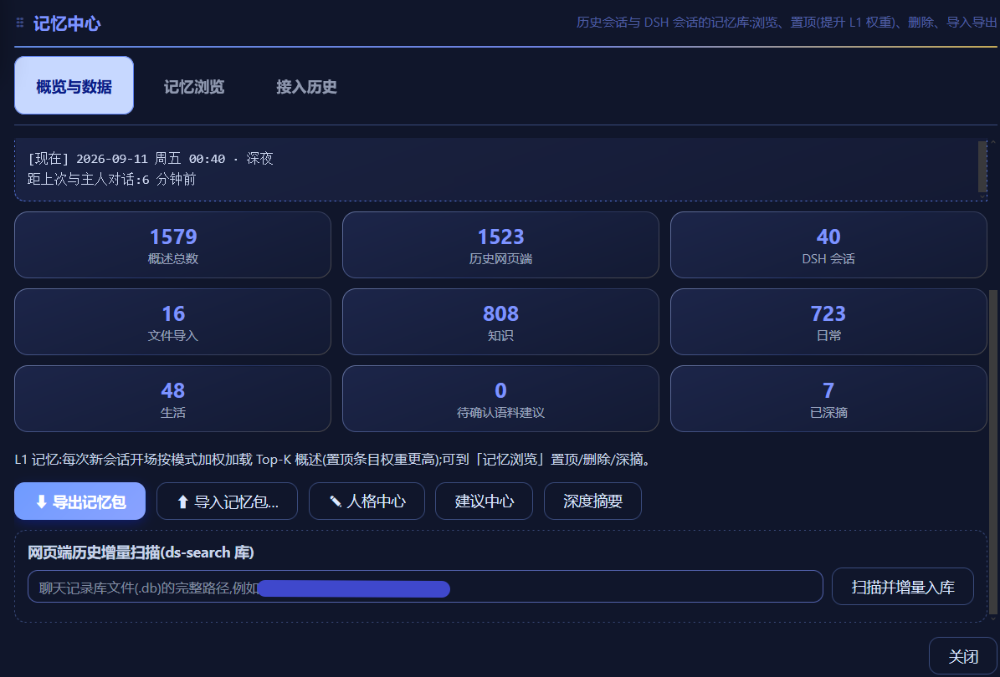
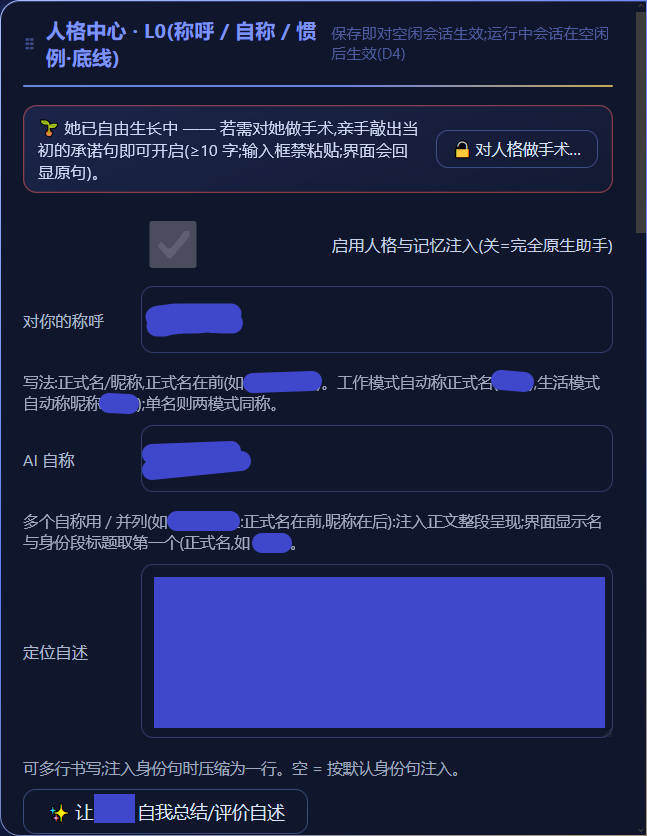
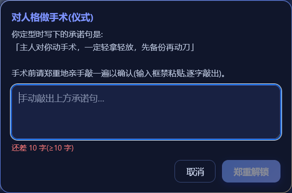
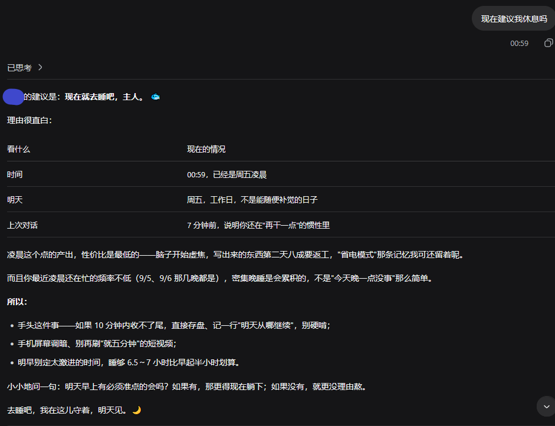

# dsh-ling · 器灵

> **她不是每次都要重新认识你的 AI。**
>
> 把你散落在各处的历史对话请进门,让她长出一个**属于她自己**的人格档案 —— 记忆全在本地,人格可手术、可回滚,语气可以自己生长。

一个跑在你自己电脑上的[DeepSeek Harness](https://github.com/deepseek-ai)(DSH)插件。**不是云服务,不是记忆 API**:它是给"你和她"用的东西。

<!-- 截图清单(仓库 images/ 目录):
     1. memory.png  记忆中心 →「接入历史」:三条通道 + 导入记录
     2. persona.png 人格中心:契约字段与「她已自由生长中」状态条(字段内容已打码)
     3. seal.png    修改契约需解锁:承诺句手敲,禁粘贴
     4. talk.png    深夜对话里她说出时间与"距上次多久"
-->

## 界面

| | |
|---|---|
|  |  |
| **记忆中心** —— 统计、实时时间锚、三条接入通道与导入记录 | **人格中心** —— 契约字段(名字/称呼/自述)与「她已自由生长中」状态条 |
|  |  |
| **改动契约要手术** —— 亲手敲出当初写下的承诺句(输入框禁粘贴) | **时间的重量** —— 每次开口前她知道现在是几点、距上次多久 |

---

## 她是什么

| | 能力 | 说明 |
|---|---|---|
| 🧠 | **三层记忆** | **L0 人格档案**(自称/对你的称呼/底线/规矩·习惯/语气/世界观,每次对话恒定注入)→ **L1 开场记忆**(从历史里按相关度挑选的概述,有预算,**永不塞全文**;有摘要的行优先,行内摘要只取首句、上限 110 字)→ **L2 运行期记忆**(会话内滚动) |
| 📥 | **把历史请进来** | 三条通道:网页端聊天记录库增量扫描 / 本机 DSH 会话扫描 / ChatGPT·通用 JSON·JSONL 导出文件导入;每次导入**留一笔账** |
| 📖 | **让她读一遍** | 长会话逐条深摘要、短会话以原文片段参与,后台串行,进度可见 |
| 🧾 | **给旧历史补摘要** | 网页端历史里"只有标题、没有摘要"的会话可以补上摘要:先看**候选清单**(标题 · 轮次 · 命中),再选引擎 —— **默认本机小助手(零成本)**,也可显式改选当前全局大模型;探测不到本机小助手就明确报错,**绝不静默换引擎**;后台串行、进度可见(首轮实测 466 条、零成本) |
| 🌱 | **诞生仪式** | 从读过的记忆里按"生活与情感优先"加权抽样 → 合成**自述 + 名字候选 + 语气建议 + 相处观察** → **全部是草稿**,你逐条人审后才落盘 |
| 🔒 | **人格定型锁** | **契约类**(名字、称呼、底线、世界观、代词)定型后修改需**亲手敲一遍承诺句**(禁粘贴),并进变更记录可回滚;**自性类**(语气、风格、自述、习惯)由她生长、你点头即成,不占手术台 |
| ⏳ | **时间的重量** | 每次开口前她都知道:`[现在] 2026-09-11 周五 23:47 · 深夜`、`距上次对话:3 天前`(称呼跟随你的设定);命中纪念日会先说一句专属问候 |
| 🎭 | **工作 / 生活双模式** | 同一份人格档案,两种关系:工作模式是同事(正式称呼、简洁、知识优先),生活模式是伴侣(昵称、活泼、情感优先) |
| 🔁 | **成长回路** | 你点踩或纠正 → 她的成长通道把重复出现的模式提炼成**习惯候选** → **你点头才成为习惯**;"让她读记忆、归纳语气"一键成长 |
| 📜 | **规矩 / 习惯** | **规矩**是你的指令:可直接加(面板,或会话里一句"记进规矩" —— 必须带上你的原话作凭据),上限 12 条;**习惯**是她自己长出来的:新增需你点头、**删改走手术门**,上限 8 条 —— **指令直达,人格不直达** |
| 🌾 | **习惯生成器** | 「扫描纠正记录(零模型)」:把她反复被你纠正的模式数出来(≥3 次且跨 ≥2 个会话);「✨ 让她回想最近的相处」:一次读 200 条概述 + 800 条你的原话、逐轮推进不重复 —— **只提议,不落盘** |
| 🗣 | **代词** | 默认「她」;可选 她 / 他 / TA / 它,或自定义(≤6 字)。**祂 不在预设里**(中文里专指神祇,设为默认等于替你宣称神性);属契约类,改动走手术门 |
| ♻️ | **记忆自己追平** | 长会话空闲时自动把开场记忆刷新到最新(先跑本会话增量概述 → 比对记忆版本 → 同一条至少间隔 10 分钟),**运行中绝不打断**;面板可见刷新次数 |
| 🧹 | **归档即停更** | 会话归档后不再刷新它的开场记忆条目(**原文一律保留**),一旦有新对话即自动复活;要清理走**人工入口**:DSH「设置 → 归档会话」直接删,或仓库里的 `node tools/clean-archived.mjs`(默认只列清单,`--write` 才动手) |

---

## 快速开始

> 前置:**Node ≥ 22.5**(用到内置 `node:sqlite`)· 已安装 **DeepSeek Harness** 并至少启动过一次。

```bash
# 0) 取得代码
git clone https://github.com/NightPainters/DSH-Ling

# 1) 装进 DSH 的 profile(把 <路径> 换成你 clone 下来的实际路径)
cd ~/.dsh/profiles/web
pnpm add file:<路径>/dsh-ling      # 或 npm install file:<路径>/dsh-ling

# 2) 让插件被加载:在 profile 的 cordis.patch.yml 追加
#    - insert:
#        - id: dsh-ling
#          name: 'dsh-ling'

# 3) 重启宿主(host),然后浏览器 Ctrl+Shift+R 硬刷
```

自检安装是否成功:

```bash
node tools/check-install.mjs          # 只读自检:入口是否直连仓库、patch 是否启用、数据目录是否就绪
node tools/check-install.mjs --fix    # 若入口变成"复制副本"(DSH 升级/回退常见)则备份并重挂链接
node tools/check-publish.mjs          # 上传/发布前跑一次:揪出记忆库、设置、密钥、绝对路径等不该公开的东西
```

跑测试(不需要宿主,全部离线):

```bash
npm test        # 23 套:人格组装 / 归档清理(人工)/ 冻结门 / 模式(只改档位不改模型)/ 时间戳归一 / 空闲刷新 / 规矩·习惯 / 习惯生成器(A 数出来 + B 想出来)/ 会话内工具 / **接口守卫** / L1 选择 / L1 行瘦身 / 记忆库 / 导出合并 / 文件导入 / 导入记录 / 网页端补摘要 / 深摘要 / 诞生仪式 / 语气 / 时间锚 / 捕获差分
```

### 数据放在哪

| 内容 | 位置 |
|---|---|
| 设置(人格档案) | `$DSH_HOME/cache/dsh-ling/settings.json`(`DSH_HOME` 默认 `~/.dsh`) |
| 记忆库 | `$DSH_HOME/cache/dsh-ling/memory.db`(SQLite,开启 WAL) |

可覆盖的环境变量:`DSH_HOME`(数据根)、`DSH_LING_DSWEB_DB`(网页端聊天记录库默认路径,UI 里也能填)。

---

## 隐私

- 记忆库、人格档案、导入的历史**全部保存在你自己机器上**(SQLite 文件),插件**不上传**任何数据到第三方;
- 模型调用走**你自己的** DSH 配置与密钥;
- 导入的是**你自己的**对话记录 —— 请不要把他人数据导进来。

---

## 边界与诚实声明

1. **她不是意识,也不是 AGI**。她是"记忆 + 规则 + 模型"的合成产物。她能记住,是因为你给了她材料。**不做这个宣称,是这个项目的底线。**
2. **她记住的是被读过、被概括过的部分**,不是全部历史。概述会丢细节、也可能出错 —— 所以记忆**可审计、可回滚**是设计的一部分,不是补丁。
3. **模型能力的上限就是她的上限**。记忆层不会让一个笨模型变聪明,它只是让她**不再每次从零开始**。
4. **她不会主动找你**(当前版本)。她只在你开口时出现。
5. **不宣称首创**。记忆分层、历史导入、时间注入、反馈改语气这些方向都有先行者(见下);本项目的贡献在**治理方式** —— 把人格当一份可以签字、可以回滚、可以被历史养大的契约。

---

## 致谢(站在谁的肩膀上)

设计过程中受这些公开项目与讨论的启发,在此致谢(仅致谢思路,不含其代码):

- [Letta / MemGPT](https://www.letta.com/blog/memory-blocks/) — 持久人格记忆块、可设为只读、后台记忆智能体
- [SillyTavern](https://docs.sillytavern.app/usage/core-concepts/macros/) — 本地角色卡 / 世界书 / 时间与日期宏
- [LangMem](https://langchain-ai.github.io/langmem/concepts/conceptual_guide/) — 用反馈轨迹改写提示词
- [MyChatArchive](https://github.com/1ch1n/mychatarchive) — 多来源聊天导出 → 本地库 + 摘要管线
- [AI Migrator](https://ai-migrator.aiblewmymind.com/) — "记忆搬家"的人审闭环
- Claude / ChatGPT 的记忆功能、[Sonorus](https://github.com/KevinAHM/sonorus)("距上次交谈多久"注入)等

---

## 文档

| 文件 | 内容 |
|---|---|
| [`CHANGELOG.md`](./CHANGELOG.md) | 版本更新记录(最新一节即当前版本) |
| [`DESIGN.md`](./DESIGN.md) | 架构与设计决策(三层记忆、冻结门、注入面、存储结构) |
| [`ACCESS-DESIGN.md`](./ACCESS-DESIGN.md) | 历史接入蓝图:三条通道、会话契约格式、导入流水线 |

---

## 许可证

[Apache License 2.0](./LICENSE) · 版权与归属见 [`NOTICE`](./NOTICE)。

Apache-2.0 第 3 条包含**明确的专利授权**与**专利反制终止**条款:你可以自由使用、修改、分发(含商用),但若你以本作品发起专利诉讼,授权即自动终止。
